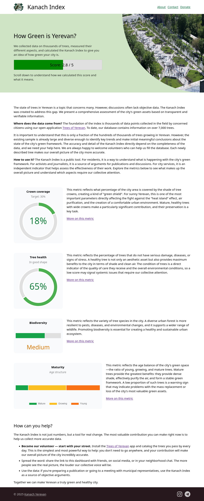

# Kanach Index

This is a static website that shows recently calculated data on how the Yerevan greenery is doing.
The data is currently hard-coded, but will be updated on scheduled basis.

Currently displayed metrics are a draft proposition.
We might want to change them after having a discussion.
The data displayed is also random, just for demonstration purposes.

